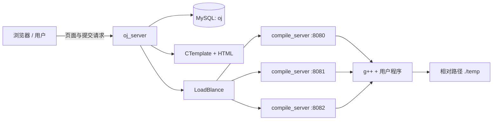

# My-Online-Judge 设计梳理与问题治理清单

> 本文基于当前仓库源码整理，目标是先理解现有设计、识别问题并确定修复顺序。本阶段只分析现状，不实施功能扩展。

## 1. 总体结论

当前项目是一个适合学习 C++ 网络编程、MVC、进程控制和简单负载均衡的 OJ 原型。它已经具备完整的最小链路：题目展示、代码编辑、公开测试、隐藏测试、编译运行、资源限制和多编译节点调度。

不过，它目前还不适合暴露到公网或运行不可信用户代码。最优先的问题不是增加登录、比赛、排行榜等功能，而是建立可靠的判题边界：隔离执行环境、统一资源单位、正确解析进程状态、补全异常处理，并确保后端故障时请求能够有限重试和明确失败。

第一阶段应坚持以下原则：

1. 先保证安全，再保证判题结果正确。
2. 先修复崩溃、无限等待和错误成功，再做代码重构。
3. 先建立可验证的测试基线，再增加新功能。
4. 所有运行参数必须有明确单位、范围和默认值。

## 2. 项目定位与现有能力

项目当前主要支持：

- 从 MySQL 读取题目列表和题目详情。
- 使用 CTemplate 将题目数据渲染为 HTML。
- 使用 cpp-httplib 提供网页和 HTTP API。
- 在浏览器中使用 ACE 编辑器编写 C++ 代码。
- 将用户代码与公开测试或隐藏测试拼接后提交给编译服务。
- 使用 `g++` 编译代码，通过子进程运行生成的程序。
- 使用 `setrlimit` 限制部分 CPU、内存和输出文件资源。
- 配置多个 `compile_server`，由 `oj_server` 按当前请求数选择节点。

当前只支持 C++，题目形式主要是“给定类和函数签名，服务端追加测试代码”。

## 3. 当前总体架构

### 3.1 组件职责

| 组件 | 当前职责 | 主要文件 |
| --- | --- | --- |
| 公共模块 | 时间、路径、临时文件、字符串切分、日志 | `common/util.hpp`、`common/log.hpp` |
| OJ 接入层 | HTTP 路由、静态文件服务 | `oj_server/oj_server.cc` |
| OJ 控制层 | 查询题目、页面组装、判题请求拼接、负载均衡 | `oj_server/oj_control.hpp` |
| 数据层 | MySQL 连接、题目查询和结果转换 | `oj_server/_oj_model.hpp` |
| 视图层 | 使用 CTemplate 渲染列表页和详情页 | `oj_server/oj_view.hpp` |
| 编译编排 | JSON 解析、编译/运行流程、状态结果序列化 | `compile_server/compile_run.hpp` |
| 编译器封装 | `fork + execlp` 调用 `g++` | `compile_server/compiler.hpp` |
| 运行器封装 | 重定向标准流、设置资源限制、运行用户程序 | `compile_server/runner.hpp` |
| 前端 | 题目列表、ACE 编辑器、测试和提交交互 | `excu/template/`、`excu/wwwroot/` |
| 数据与配置 | SQL 备份、编译节点列表 | `beifen.sql`、`excu/conf/service_machine.conf` |

### 3.2 运行时目录约定

CMake 将两个可执行文件输出到 `excu/`。代码中的模板、静态文件、节点配置和临时目录都使用相对路径：

- OJ 节点配置：`./conf/service_machine.conf`
- HTML 模板：`./template/`
- 静态文件：`./wwwroot`
- 判题临时文件：`./temp/`

因此当前程序实际上要求从 `excu/` 作为工作目录启动。换一个目录启动，即使二进制本身存在，也可能找不到配置、模板或静态文件。

## 4. 核心设计与数据流

### 4.1 页面访问链路

1. 浏览器访问根路径，`httplib` 从 `./wwwroot` 返回 `index.html`。
2. `index.html` 跳转到 `/all_questions`。
3. `oj_server` 调用 `Model::GetAllQuestions` 查询 MySQL。
4. 控制层按题号排序。
5. `View::AllExpandHtml` 使用 `all_questions.html` 渲染题目列表。
6. 用户访问 `/question/{number}` 时，查询单题并用 `one_question.html` 渲染代码编辑页。

### 4.2 测试和正式提交链路

前端提供两种操作：

| 操作 | OJ 路由 | 服务端追加内容 | 当前语义 |
| --- | --- | --- | --- |
| 本地测试 | `POST /judge/{number}` | `q.tail` | 运行公开测试并展示输出 |
| 正式提交 | `POST /runtest/{number}` | `q.test` | 运行隐藏测试，失败时退出 `-5` |

完整流程如下：

1. 浏览器发送用户代码和 `input`。
2. `Control::Judge` 查询题目。
3. 控制层将用户代码与 `tail` 或 `test` 直接进行字符串拼接。
4. 控制层加入题目配置的 `cpu_limit` 和 `mem_limit`，生成 JSON。
5. `LoadBlance` 选择当前 `load` 最小的编译节点。
6. OJ 向该节点的 `/compile_and_run` 发起 HTTP 请求。
7. 编译节点返回状态、原因、标准输出和标准错误。
8. OJ 将响应原样转发给浏览器。

### 4.3 编译节点内部流程

1. 解析 JSON，取出 `code`、`input`、CPU 和内存限制。
2. 以“毫秒时间戳 + 进程内原子计数”生成任务文件名。
3. 将代码写入 `./temp/{job}.cpp`。
4. `fork` 子进程并执行 `g++ -std=c++11`。
5. 编译成功后再次 `fork`，重定向 stdin/stdout/stderr。
6. 设置 `RLIMIT_CPU`、`RLIMIT_AS`、`RLIMIT_FSIZE`。
7. 执行用户程序并等待退出。
8. 将运行状态转换为业务状态，读取输出并组装 JSON。
9. 删除该任务的临时文件。

### 4.4 当前题目数据模型

`Question` 包含：

| 字段 | 含义 |
| --- | --- |
| `number` | 题号 |
| `title` | 标题 |
| `difficulty` | 难度，对应数据库 `star` |
| `desc` | 题目描述 |
| `header` | 提供给用户的起始代码 |
| `tail` | 公开测试代码 |
| `test` | 隐藏测试代码 |
| `cpu_limit` | CPU 限制，当前按秒使用 |
| `mem_limit` | 内存限制，但当前各层单位不一致 |

仓库还保留了文件题库版本 `oj_model.hpp` 和 `oj_server/question/`，但 `oj_model.hpp` 已被整体注释；实际运行使用 `_oj_model.hpp` 的 MySQL 版本。

## 5. 现有设计中值得保留的部分

- 门户服务和编译服务分离，具备进一步隔离和横向扩容的基础。
- Model、View、Control 的职责已有初步划分。
- 编译和运行被拆成独立阶段，错误信息可以分别处理。
- 临时文件按任务命名，并在正常流程结束后清理。
- 使用原子计数减少同一进程内并发任务的文件名冲突。
- 已限制 CPU 时间、虚拟地址空间和输出文件大小。
- stdout/stderr 返回值已有 64 KB 截断，避免正常运行结果无限放大响应。
- 编译节点配置独立于代码，可启动多个相同 worker。
- 前端使用 `textContent` 展示大部分结果，具有基本的输出注入意识。

这些设计可以作为后续优化的基础，不必推倒重写整个项目。

## 6. 问题分级说明

- **P0：阻断问题。** 可能导致宿主机被攻击、判题结果错误、服务崩溃、无限等待，必须在功能扩展前解决。
- **P1：高优先级问题。** 会造成稳定性、并发、数据安全或部署问题，应在第一轮治理中完成。
- **P2：工程质量问题。** 不一定立即造成事故，但会显著增加后续开发成本。

## 7. P0：必须首先处理的问题

### P0-1 用户代码直接运行在宿主机，没有真正的安全隔离

**现状：** `runner.hpp` 只使用 `setrlimit` 后直接 `execl` 用户程序；`compile_server` 又监听 `0.0.0.0`，没有认证。

**风险：** 用户程序仍然可以读取服务账号有权限读取的文件、访问网络、创建子进程、扫描内网、占用进程数或利用系统漏洞。预处理阶段也可能通过包含本地文件泄漏信息。`setrlimit` 不是沙箱。

**建议方向：**

- 在隔离容器或专用沙箱中执行每个任务，至少隔离 PID、mount、network、user、IPC 等命名空间。
- 使用非特权 UID，根文件系统只读，为任务提供独立临时目录。
- 配合 cgroup v2 限制 CPU、内存、进程数和 I/O。
- 默认禁用网络，设置 seccomp/AppArmor 等系统调用策略。
- 编译服务只监听内网或回环地址，不对公网直接开放；增加服务间认证。
- 沙箱完成前，只允许在本机可信测试数据下运行，不能接受不可信提交。

### P0-2 资源限制不完整，而且内存单位严重不一致

**现状：** 页面把 `mem_limit` 显示为 KB；SQL 中常见值为 `256000`；编译节点却把它当 MB，再乘 `1024 * 1024`。这会把约 250 MB 的目标限制放大为约 250 GB。CPU 只限制 CPU 时间，不限制墙上时间；睡眠或阻塞程序可能长期占用 worker。编译过程本身没有时间和内存限制。

**风险：** 内存限制基本失效，编译炸弹、休眠程序、fork bomb 和残留子进程可能拖垮节点。

**建议方向：**

- 全链路统一单位，例如 `cpu_limit_ms` 和 `memory_limit_bytes`，字段名直接包含单位。
- 对入参设置最小值、最大值和默认值，拒绝 0、负数和异常大值。
- 同时限制编译阶段和运行阶段。
- 增加墙上时间超时；超时后终止整个任务进程组或 cgroup，而不是只等待直接子进程。
- 检查每次 `setrlimit` 的返回值，失败时不得继续执行任务。
- 限制进程数、打开文件数、磁盘空间和输出总量。

### P0-3 子进程退出状态解析错误，会把失败判成成功

**现状：** `Runner::Run` 使用魔数 `64256` 识别 `exit(-5)`，其他情况直接返回 `status & 0x7f`。

**风险：** 普通非零退出码通常不会被正确识别。例如程序 `return 1` 的 wait status 是退出码左移后的值，`status & 0x7f` 可能得到 0，从而被判为成功。信号、core dump 和正常退出也没有按 POSIX 宏区分。

**建议方向：** 使用 `WIFEXITED`、`WEXITSTATUS`、`WIFSIGNALED`、`WTERMSIG`、`WCOREDUMP` 等宏解析状态，移除魔数。定义清晰的判题枚举，例如 AC、WA、CE、RE、TLE、MLE、OLE、SE，并保持 API 状态一致。

### P0-4 当前测试代码可以被用户提交绕过

**现状：** 用户代码与服务端测试代码直接拼接成同一个源文件、同一个进程。正式提交只依靠测试代码在失败时 `exit(-5)`。

**风险：** 用户可以通过预处理宏、注释、提前退出、全局构造、重定义符号等方式干扰或绕过追加的测试代码。仅凭进程退出成功不能证明答案正确。

**建议方向：**

- 将用户程序与判题器边界分开，不让用户代码控制判题主流程。
- 对标准输入输出型题目，由独立 checker 比较用户输出和标准输出。
- 对函数型题目，可生成固定驱动程序并严格限定用户提交区域，但仍需在隔离环境内执行。
- 隐藏用例和判题结果由宿主判题器管理，不依赖用户进程自行声明成功。

### P0-5 题目不存在或数据库异常时可能越界崩溃

**现状：** `Model::GetOneQuestion` 在查询返回 true 后直接读取 `result[0]`，没有判断结果是否为空。`Control::Judge` 又忽略 `GetOneQuestion` 的返回值，继续使用未有效赋值的题目对象。

**风险：** 请求不存在的题号、空表或部分数据库异常可能导致越界访问、未初始化限制值或服务崩溃。

**建议方向：** 查询接口应明确区分“成功且有数据”“成功但不存在”“数据库错误”。访问结果前必须检查容器；控制层发现题目不存在时立即返回稳定的 JSON 错误和 HTTP 404。

### P0-6 编译节点失败路径可能无限循环或返回空响应

**现状：** `Control::Judge` 使用 `while (true)` 选择节点。网络连接失败时会将节点下线，但后端返回非 200 时只减负载、不下线也不退出，下一轮可能反复选择同一节点。全部节点离线后只是 `break`，没有确保 `out_json` 已赋值。HTTP Client 未显式设置连接、读写和总任务超时。

**风险：** 请求线程可能无限重试或长期阻塞；前端收到空响应后 JSON 解析失败；大量请求会耗尽线程。

**建议方向：** 每个节点一次请求内最多尝试一次，设置明确的总重试次数和超时；按失败类型决定熔断；无可用节点时返回 HTTP 503 和结构化错误。负载计数使用 RAII，确保所有异常路径都能归还。

## 8. P1：第一阶段应继续修复的问题

### 8.1 输入和 API 契约不完整

- `compile_run.hpp` 中写 stdin 文件的代码被注释，用户提交的 `input` 实际未生效。
- `oj_view.hpp` 没有设置 `TEST_INPUT`，但模板仍发送该占位符。
- JSON 解析结果未全面检查；缺字段、类型错误、超大代码、非法限制值没有统一处理。
- 请求失败仍普遍返回 HTTP 200，题目不存在、数据库错误、无 worker 等情况缺少正确状态码。
- 编译服务收到空 body 时不设置响应体。

应先定义请求/响应 schema，再由两端严格校验。前端不应自行猜测状态含义。

### 8.2 编译与运行错误分类不可靠

- `SIGABRT` 被固定描述为“内存超限”，但它也可能来自用户主动调用 `abort` 或未捕获异常。
- 没有完整区分 SIGSEGV、SIGKILL、SIGXFSZ 等常见情况。
- 编译成功只通过“可执行文件是否存在”判断，没有检查 `waitpid` 的退出状态。
- 编译错误文本没有像 stdout/stderr 一样限制返回大小。
- 子进程中失败后使用 `exit`，更稳妥的方式是 `_exit`，避免重复刷新继承的缓冲区。

### 8.3 临时文件和任务生命周期不够稳健

- 文件名只在单进程生命周期内近似唯一；多 worker 共用目录或进程快速重启时仍可能冲突。
- `./temp` 依赖工作目录，目录创建存在竞态且忽略失败。
- 编译错误文件打开时缺少 `O_TRUNC`，文件名碰撞时可能残留旧内容。
- 进程崩溃、被强杀或节点重启时没有过期任务清理机制。
- 所有任务共享一个目录，权限边界不清晰。

建议每个 job 使用不可预测的 ID 和独立目录，并用 RAII 管理目录生命周期；进程启动时清理过期任务。

### 8.4 MySQL 使用方式需要治理

- 数据库地址、用户和明文密码硬编码在 `_oj_model.hpp`。
- 每次查询都新建连接，没有连接池或复用。
- 使用 `select *` 并按列位置映射，表结构改变后容易静默错位。
- SQL 通过字符串拼接生成。当前路由限制为数字降低了注入风险，但模型层本身不安全。
- `mysql_store_result` 返回空时的错误判断不准确，部分失败可能被当作成功。
- 字符集设置为 `utf8`，数据库也保留 `utf8mb3`，建议统一为 `utf8mb4`。
- 表名 `oj_questios` 拼写错误，后续若修正需要正式迁移，不能只改一处。
- `beifen.sql` 包含 `DROP TABLE`，它是备份，不是安全、可重复执行的版本化迁移。

建议把配置移到环境变量或配置文件；使用预处理语句、显式列名、RAII 连接封装和版本化 migration。

### 8.5 负载均衡存在并发和资源管理问题

- `Machine` 用 `new std::mutex` 和裸指针管理锁，析构时没有释放，且复制对象共享指针。
- 大量手动 `lock/unlock`，异常时可能无法解锁，应改用 `std::lock_guard` 或 `std::scoped_lock`。
- 选中节点和增加负载不是一个原子操作，并发请求可能同时选中相同的“最低负载”节点。
- `load` 是无符号数，计数不平衡时会下溢成极大值。
- 节点下线后只能依靠 SIGQUIT 一次性全部上线，没有定时健康检查、半开探测或逐节点恢复。
- 在信号处理函数中调用 mutex、日志和复杂 C++ 对象不是异步信号安全操作，可能死锁或产生未定义行为。

### 8.6 页面模板存在注入和显示问题

- 模板没有显式启用上下文相关转义，数据库中的标题、描述等内容应按 HTML 上下文转义。
- `HEADER` 被直接放入 JavaScript 模板字符串；如果代码包含反引号或 `${...}`，会破坏脚本，甚至形成存储型脚本注入。
- `escapeHtml(msg)` 后又通过 `textContent` 显示，会产生重复转义，用户可能看到 `&lt;` 等文本。
- ACE 通过外部 CDN 加载，`integrity` 为空；离线环境无法使用，也缺少有效的资源完整性校验。
- 数据库难度使用 `easy/medium`，视图层却只识别“简单/中等/困难”，导致 `medium` 等值回落到 easy 样式。

建议将页面数据通过安全 JSON 序列化注入或由 API 获取，避免把任意代码直接嵌入脚本源码。

### 8.7 服务缺少容量控制与可观测性

- 没有项目级请求体大小、并发任务数、队列长度和单用户频率限制。
- 没有 job ID 贯穿 OJ、worker、编译和运行日志，问题难以追踪。
- 日志由多个线程直接写 `std::cout`，可能交错；没有结构化字段、持久化、轮转和采样。
- `FATAL` 只是日志文本，并不保证进程退出。
- 缺少就绪检查、详细健康检查、指标和优雅停机。

## 9. P2：工程结构与维护问题

### 9.1 源码边界和依赖关系

- 大量实现放在 `.hpp` 中，未来增加多个翻译单元后容易出现 ODR、编译时间和依赖扩散问题。
- `oj_view.hpp` 包含已被整体注释的 `oj_model.hpp`，实际依赖 `_oj_model.hpp` 由控制层提前包含；这是偶然的 include 顺序依赖。
- 文件版 Model 以整文件注释形式保留，数据库版使用 `_oj_model.hpp` 命名，职责和版本选择不清晰。
- 多个文件包含大量未使用的 STL 头文件、重复头文件和遗留注释代码。
- `LoadBlance`、`excu`、`oj_questios` 等命名拼写不规范，应通过兼容迁移逐步修正。

建议先提取稳定的领域类型和接口，例如 `Question`、`QuestionRepository`、`JudgeRequest`、`JudgeResult`，再拆分 `.hpp/.cc`，不要直接进行大规模无测试重写。

### 9.2 构建与依赖管理

- CMake 直接写 `jsoncpp`、`ctemplate`、`mysqlclient`，没有在配置阶段明确查找依赖和版本。
- `oj_server/include`、`oj_server/lib` 是指向仓库外 `mysql-connect` 的失效符号链接，CMake 仍把它们加入搜索路径。
- 根 CMake 使用 C++17，独立 Makefile 和用户代码编译使用 C++11，标准不统一。
- CMake 和两个手写 Makefile 并存，输出位置和参数不一致。
- 没有启用 `-Wall -Wextra -Wpedantic` 等基础告警，也没有 Debug/Release、Sanitizer 和测试目标。
- 构建产物输出到源码目录 `excu/`，运行资源和生成文件混在一起。

当前使用额外告警检查时已看到整数收窄转换和未使用参数等警告，应把告警加入持续构建，而不是依靠临时命令。

### 9.3 Git 与仓库卫生

- `.gitignore` 当前包含 `/oj_server`，会导致该核心源码目录中新建的文件被静默忽略，必须删除这条规则。
- `/compiler_server` 与实际目录 `compile_server` 不一致，规则没有达到预期目的。
- 应只忽略构建目录、可执行文件、临时任务目录和本地配置，不能忽略源码目录。
- `.vscode/settings.json` 是否共享应明确，避免把个人环境路径提交为项目配置。

### 9.4 文档、测试和交付

- README 的目录名写成 `Online_Judge`，与仓库名不一致。
- README 使用 `cmake .. & make`，其中 `&` 会导致构建竞态，应为 `&&` 或 `cmake --build`。
- 没有完整列出系统依赖、MySQL 初始化、SQL 导入、启动顺序、端口和工作目录要求。
- 没有单元测试、集成测试、错误判题测试、安全回归测试或 CI。
- 没有 Docker/服务管理配置，也没有开发、测试、生产环境的配置分层。

## 10. 第一阶段建议实施顺序

这一阶段只治理现有问题，不增加用户系统、比赛、排行榜等新功能。

### 里程碑 0：建立基线和契约

1. 修复 `.gitignore`，清理失效符号链接和重复构建方式。
2. 在 CMake 中显式发现依赖，统一 C++ 标准并打开基础告警。
3. 定义 `JudgeRequest`、`JudgeResult` 和状态枚举，固定 JSON schema。
4. 明确所有资源单位，在变量名、数据库字段和页面上保持一致。
5. 建立最小回归测试：CE、AC、WA、RE、TLE、MLE、OLE、空代码、缺字段、题目不存在、worker 不可用。

### 里程碑 1：建立安全执行边界

1. 将 worker 限制在内网/本机，不再直接公网监听。
2. 为每个 job 建立独立沙箱、非特权用户、只读文件系统和禁网策略。
3. 用 cgroup 管理整个任务进程树，限制内存、CPU、PID 和 I/O。
4. 对编译与运行分别设置墙上时间和资源上限。
5. 确保超时、取消和服务退出时能够杀死整个任务，而不是只处理直接子进程。

### 里程碑 2：修正判题正确性

1. 使用 POSIX 宏正确解析 wait status，移除 `64256` 等魔数。
2. 统一 AC/WA/CE/RE/TLE/MLE/OLE/SE 状态及 HTTP 映射。
3. 修复内存单位和 stdin 输入链路。
4. 将判题器与用户代码分离，避免用户控制成功状态。
5. 修复不存在题目、空查询、非法 JSON 和非法限制值的处理。

### 里程碑 3：提升服务可靠性

1. 为 worker 调用设置连接、读写和总超时。
2. 实现有限重试、逐节点熔断、健康检查和自动恢复。
3. 使用 RAII 管理负载计数、锁、MySQL 资源、文件描述符和临时目录。
4. 增加任务队列、并发上限、背压和 503 响应。
5. 引入 job ID、结构化日志、指标和优雅停机。

### 里程碑 4：整理数据层和代码结构

1. 提取领域模型与 repository 接口，去除 include 顺序依赖。
2. 将 MySQL 配置移出源码，使用显式列名、预处理语句和连接管理。
3. 使用版本化 SQL migration，逐步修复表名和字符集。
4. 将实现从大型头文件迁移到 `.cc`，删除已废弃的整段注释代码。
5. 补齐 README、自动化测试和 CI。

完成以上里程碑后，再开始功能层优化会更稳妥。

## 11. 第一阶段验收标准

满足以下条件，才建议进入功能扩展阶段：

- 任意用户代码都运行在受限沙箱内，无法访问宿主敏感文件和外部网络。
- 编译和运行都有墙上时间、CPU、内存、进程数、磁盘和输出限制。
- AC、WA、CE、RE、TLE、MLE、OLE、内部错误能够稳定区分。
- 普通非零退出、信号退出、超时和子进程残留都有自动化测试。
- 内存与时间单位在数据库、API、worker 和页面中完全一致。
- 题目不存在、数据库失败、worker 全部不可用时不会崩溃或无限等待。
- 每个请求都能在有限时间内返回结构化 JSON 和正确 HTTP 状态码。
- worker 不直接暴露公网，服务间调用有明确的网络边界。
- MySQL 密码不再硬编码，SQL 查询不再依赖 `select *` 的列顺序。
- 核心模块有单元测试和端到端测试，CMake 构建在 CI 中可重复通过。

## 12. 后续功能优化方向（暂不实施）

完成问题治理后，可以再评估：

- 用户注册、登录、权限和个人提交记录。
- 提交记录、异步判题队列和实时状态查询。
- 比赛、排行榜、题目标签、搜索和难度筛选。
- 多语言编译配置。
- Special Judge、交互题、分组测试和部分得分。
- 管理后台、题目版本、测试数据管理和重判。
- 运行时间/内存统计、代码分享和题解系统。

这些功能都依赖稳定的任务模型、判题状态、隔离环境和数据迁移机制，因此不应早于第一阶段治理。

## 13. 本次分析验证范围

- 已阅读项目的 CMake、README、公共模块、OJ 服务、编译服务、页面模板、节点配置、文件题库和 SQL 备份。
- 当前环境中 `jsoncpp`、`ctemplate` 和 MySQL 开发依赖齐全。
- 已执行 CMake 配置和构建，`oj_server` 与 `compile_server` 两个目标均可构建通过。
- 已使用额外编译告警进行静态检查。
- 本次没有启动完整服务链路、提交真实判题任务，也没有进行沙箱安全测试；运行时结论来自源码路径分析。
